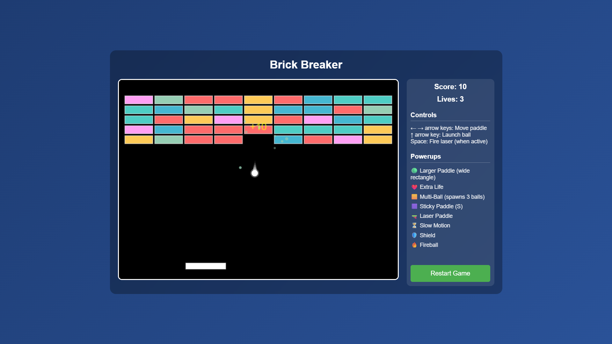
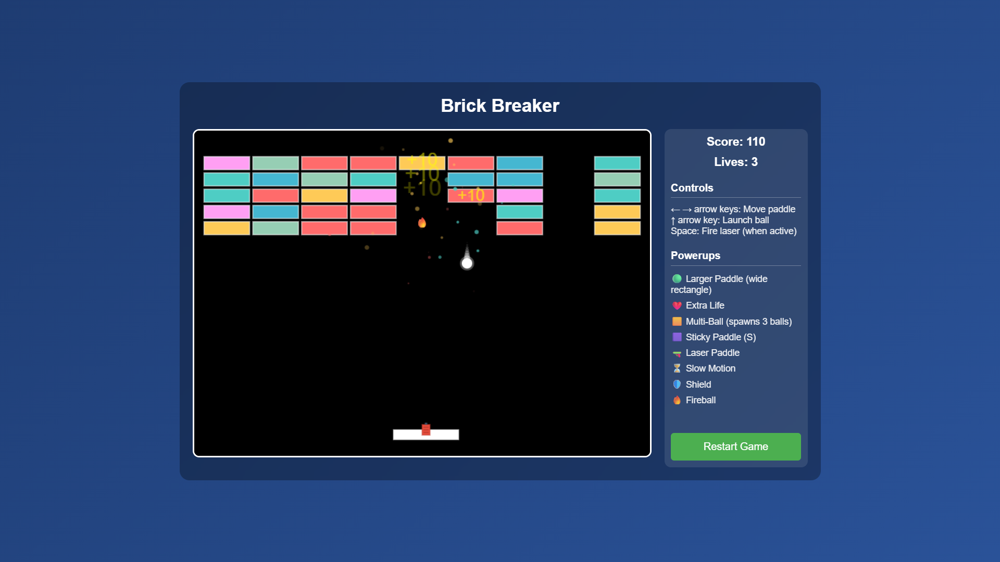
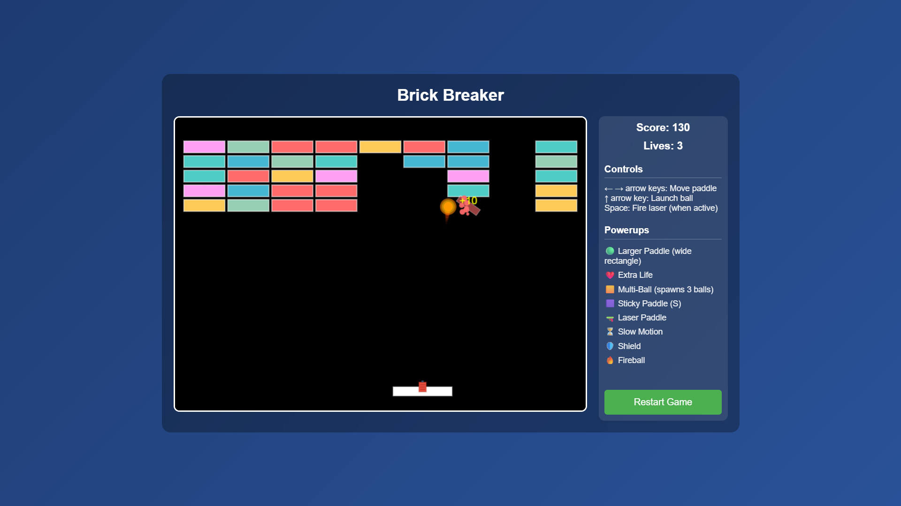

# 🧱 Brick Breaker Game

A modern, feature-rich implementation of the classic Brick Breaker arcade game built with pure HTML5, CSS3, and JavaScript. Experience smooth 60fps gameplay with advanced powerups, particle effects, and responsive design.

## 🎮 Demo & Screenshots


*Game start screen showing colorful brick layout and control panel*


*Mid-game action with particle effects and score display*


*Powerup system in action with visual effects*

## ✨ Features

### Core Gameplay
- **Classic Brick Breaker Mechanics** - Paddle control, ball physics, and brick destruction
- **60fps Smooth Animation** - Fluid gameplay using HTML5 Canvas and requestAnimationFrame
- **Advanced Physics Engine** - Custom collision detection and realistic ball movement
- **Progressive Difficulty** - Strategic brick layouts and challenging gameplay

### Powerup System (8 Unique Types)
- 🟢 **Larger Paddle** - Extends paddle width with visual glow effects
- ❤️ **Extra Life** - Grants additional lives for extended gameplay
- 🟨 **Multi-Ball** - Spawns multiple balls (3 from paddle, 2 from bouncing ball)
- 🟪 **Sticky Paddle** - Balls attach to paddle for strategic positioning
- 🔫 **Laser Paddle** - Fire lasers with spacebar to destroy bricks
- ⏳ **Slow Motion** - Reduces game speed for precision control
- 🛡️ **Shield** - Protective barrier with damage system
- 🔥 **Fireball** - Ball destroys bricks without bouncing

### Visual Polish
- **Particle Effects** - Explosion animations and visual feedback
- **Floating Score Popups** - Real-time score indicators
- **Colorful Brick Design** - Randomly colored bricks with smooth destruction
- **Responsive UI** - Clean layout with game info panel
- **Warning Systems** - Visual cues for powerup expiration

### Technical Features
- **Zero Dependencies** - Pure vanilla JavaScript implementation
- **Cross-Browser Compatible** - Works in all modern browsers
- **Offline Capable** - No internet connection required
- **Mobile Friendly** - Responsive design for various screen sizes

## 🚀 Installation

### Quick Start (Replit)
1. The game is already configured and ready to run
2. Click the "Run" button in Replit
3. Open the provided URL to start playing

### Local Installation
1. **Clone or download** the project files
2. **Start a local server** (required for proper file loading):
   ```bash
   # Using Python 3
   python3 -m http.server 5000
   
   # Using Node.js (if available)
   npx serve
   
   # Using PHP (if available)
   php -S localhost:5000
   ```
3. **Open your browser** and navigate to `http://localhost:5000`
4. **Start playing!**

### File Structure
```
brick-breaker/
├── index.html          # Main game HTML file
├── style.css           # Game styling and layout
├── game.js             # Complete game logic and classes
├── README.md           # Project documentation
└── attached_assets/    # Screenshots and assets
```

## 🎯 How to Play

### Objective
Destroy all the colorful bricks using the ball while keeping it from falling off the bottom of the screen.

### Controls
- **← → Arrow Keys** - Move paddle left and right
- **↑ Arrow Key** - Launch ball from paddle
- **Spacebar** - Fire laser (when Laser Paddle powerup is active)
- **Restart Button** - Reset the game at any time

### Gameplay Mechanics
1. **Launch the Ball** - Press ↑ arrow key to launch ball from paddle
2. **Keep Ball in Play** - Use paddle to bounce ball back up
3. **Destroy Bricks** - Ball destroys bricks on contact (10 points each)
4. **Collect Powerups** - 25% chance for destroyed bricks to drop powerups
5. **Use Special Abilities** - Activate powerup effects strategically
6. **Win Condition** - Destroy all bricks to complete the level
7. **Lives System** - Game over when all 3 lives are lost

### Powerup Strategy Tips
- **Sticky Paddle** - Catch ball for precise aiming
- **Multi-Ball** - Increases brick destruction rate
- **Laser Paddle** - Clear difficult-to-reach bricks
- **Shield** - Protects against ball loss
- **Fireball** - Breaks through multiple brick layers

## 🛠️ Technologies Used

### Core Technologies
- **HTML5** - Document structure and Canvas element
- **CSS3** - Styling, gradients, and responsive design
- **Vanilla JavaScript ES6** - Game logic and modern syntax

### APIs & Features Used
- **Canvas 2D Rendering Context** - Game graphics and animations
- **requestAnimationFrame** - Smooth 60fps game loop
- **Keyboard Event API** - Player input handling
- **CSS Flexbox** - Responsive layout design

### Development Tools
- **Python 3.11** - HTTP server for development
- **No Build Tools** - Direct browser execution
- **No External Dependencies** - Self-contained implementation

## 📁 Project Structure

```
src/
├── index.html          # Game container and UI elements
├── style.css           # Visual styling and responsive design
└── game.js             # Game engine and classes:
    ├── Vector2         # 2D vector mathematics
    ├── Particle        # Visual effects system
    ├── ScorePopup      # Floating score indicators
    ├── Ball            # Ball physics and collision
    ├── Paddle          # Player paddle with powerups
    ├── Brick           # Destructible brick entities
    ├── Powerup         # Powerup items and effects
    ├── Laser           # Laser projectile system
    ├── Shield          # Protective barrier system
    └── Game            # Main game controller
```

## 🤝 Contributing

Contributions are welcome! Here's how you can help:

### Development Guidelines
1. **Fork the repository** and create a feature branch
2. **Maintain vanilla JavaScript** - No external dependencies
3. **Test across browsers** - Ensure compatibility
4. **Follow existing code style** - ES6 classes and modern syntax
5. **Add comments** for complex game logic
6. **Update documentation** as needed

### Areas for Contribution
- **New Powerups** - Additional game mechanics
- **Level System** - Multiple brick layouts
- **Sound Effects** - Audio feedback system
- **Mobile Controls** - Touch input support
- **High Score System** - Local storage integration
- **Visual Themes** - Alternative color schemes

### Bug Reports
- **Use GitHub Issues** for bug tracking
- **Include browser information** and steps to reproduce
- **Provide screenshots** if applicable

## 📄 License

This project is licensed under the **MIT License**.

```
MIT License

Permission is hereby granted, free of charge, to any person obtaining a copy
of this software and associated documentation files (the "Software"), to deal
in the Software without restriction, including without limitation the rights
to use, copy, modify, merge, publish, distribute, sublicense, and/or sell
copies of the Software, and to permit persons to whom the Software is
furnished to do so, subject to the following conditions:

The above copyright notice and this permission notice shall be included in all
copies or substantial portions of the Software.

THE SOFTWARE IS PROVIDED "AS IS", WITHOUT WARRANTY OF ANY KIND, EXPRESS OR
IMPLIED, INCLUDING BUT NOT LIMITED TO THE WARRANTIES OF MERCHANTABILITY,
FITNESS FOR A PARTICULAR PURPOSE AND NONINFRINGEMENT.
```

## 🎖️ Credits

### Inspiration
- **Classic Atari Breakout** - Original arcade game concept
- **Modern HTML5 Games** - Contemporary web game development practices

### Development
- **Pure JavaScript Implementation** - No external frameworks used
- **HTML5 Canvas API** - Graphics rendering capabilities
- **CSS3 Features** - Modern styling and animations

### Assets
- **Custom Particle System** - Original visual effects implementation
- **Responsive Design** - Mobile-friendly layout architecture
- **Color Palette** - Vibrant gradient backgrounds and brick colors

## 📞 Contact

For questions, feedback, or collaboration opportunities:

- **Project Repository** - [Your GitHub/Replit URL]
- **Email** - [your.email@example.com]
- **Discord/Social** - [Your preferred contact method]

### Feedback Welcome
- **Feature Requests** - Suggest new powerups or game mechanics
- **Bug Reports** - Help improve game stability
- **Performance Issues** - Report any lag or compatibility problems
- **Gameplay Balance** - Share thoughts on difficulty and powerup effectiveness

---

**Built with ❤️ using pure web technologies**

*Enjoy breaking those bricks!* 🧱💥